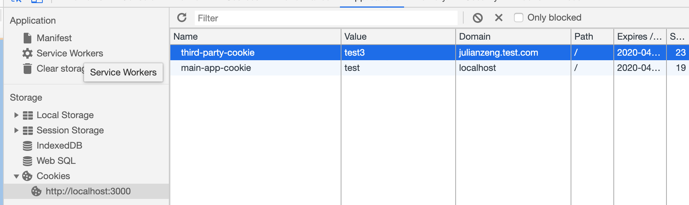
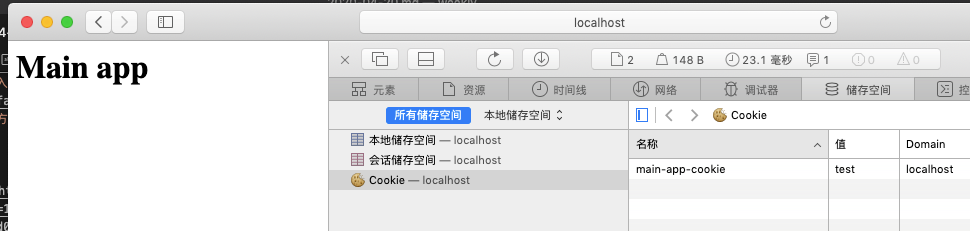

[toc]

# 2020-04-20

## 阅读 ✨✨✨

* [Service Worker：让你的 Web 应用牛逼起来](https://www.ershicimi.com/p/92c9d2d18eedce5e402757a3b58b4886)[Service Worker]
* [五分钟看懂 Nginx 负载均衡](https://www.ershicimi.com/p/cddbb3e748e6b68778198ae556be3f41)[Nginx]
* [【Vuejs】571- Vue 虚拟DOM和Diff算法源码解析](https://www.ershicimi.com/p/daa7ebfee5fd987dab069f9173f9f11e) [Vue]
* [【Vue3.0】尤雨溪 - 聊聊 Vue.js 3.0 Beta 官方直播完整版 2020-04-21](https://www.bilibili.com/video/BV1Tg4y1z7FH)[Vue]
* [vue3-News](https://github.com/vue3/vue3-News)[Vue]
* [前端精神小伙：React Hooks 响应式布局](https://www.ershicimi.com/p/a3c3f8cd73b08322d840b917c65eb397)
* [我是如何把node接口耗时降低23%的](https://www.ershicimi.com/p/fc2cb10594d5d1cd2073d1f383cfb232)[NodeJs]
* [微前端框架是怎么导入加载子应用的](https://www.ershicimi.com/p/2f6072feaecd1f9d00fabadb870cf316)[微前端]
* [当浏览器全面禁用三方 Cookie](https://juejin.im/post/5e97124df265da47b27d97ff)

## 阅读延伸 ✨

* [了解什么是微前端](https://mp.weixin.qq.com/s?__biz=MzAxODE2MjM1MA==&mid=2651557556&idx=1&sn=49ba9f2685b968ed02b779b503480d3d&chksm=80255975b752d0639d27ebb4e4c421bdd7f041288f4da6fd74fc45ea26671b979317ddcd8f57&scene=21#wechat_redirect)

## 解读

### 关于三方cookie

首先，三方cookie不是指我在`a.com/`的相应头中指定`set-cookie`的Domian值为三方域名`b.com`，这样做是不能设置成功的，从安全的较多是不太可能允许随便修改其他域的cookie的。

实际上这里应该是指`a.com/`的页面中通过引入第三方资源比如`b.com/index.js`, `b.com/index.js`这个资源的响应头通过`set-cookie`将cookie写到`b.com`的域名下了

而相同的应用，到safari访问可以看到，三方cookie不能设置了

三方cookie的用途
* 同一产品线不同域名，一次登录不需重复登录的问题 
* 三方统计SDK通过三方cookie标记用户
* 广告营销神器 - Facebook Pixel

目前在 Safari 13.1、Firefox 79 版本中，三方 Cookie 已经被默认禁用

Chrome —— SameSite Cookie
https://developer.mozilla.org/en-US/docs/Web/HTTP/Headers/Set-Cookie/SameSite

* Strict： 请求时只能携带一方cookie
* Lax： 请求时可以携带一方cookie，三方的GET请求也能携带cookie （大多数浏览器默认的值）
* None： 请求可以携带所有cookie，包括三方的cookie

Chrome 也宣布，将在下个版本也就是 Chrome 83 版本，在访客模式下禁用三方 Cookie，在 2022 年全面禁用三方 Cookie，到时候，即使你能指定 SameSite 为 None 也没有意义，因为你已经无法写入第三方 Cookie 了。

#### 替代方案

* 使用一方 Cookie 替代 三方 Cookie
* 浏览器指纹
* Canvas 指纹