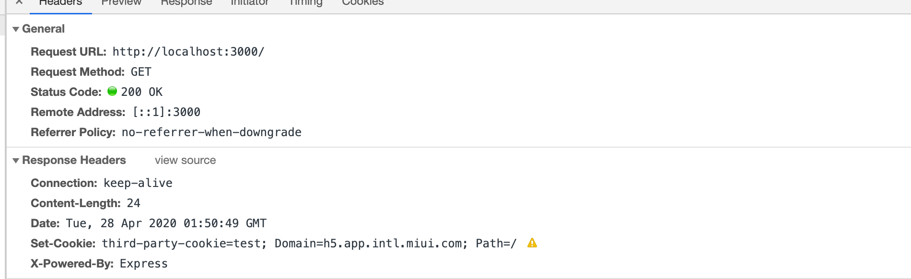
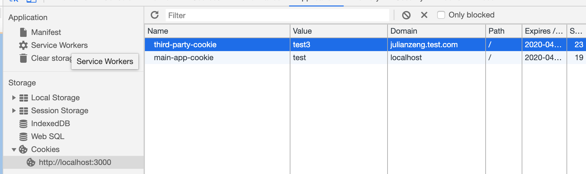
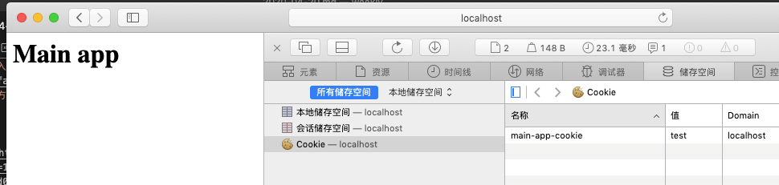

# 2020年刊

# 2020-12-28

## 阅读 ✨✨✨

* [Luckysheet is an online spreadsheet like excel that is powerful, simple to configure, and completely open source.](https://github.com/mengshukeji/Luckysheet)

## 阅读延伸 ✨

# 2020-12-14

## 阅读 ✨✨✨

* [云凤蝶可视化搭建的推导与实现-江木.pdf](../../../assets/pdf/云凤蝶可视化搭建的推导与实现-江木.pdf)
* [云凤蝶可视化搭建的推导与实现](https://www.bilibili.com/video/av83238754)
* [前端可视化搭建二三事](https://github.com/SunXinFei/sunxinfei.github.io/issues/26)

## 阅读延伸 ✨

* [9.9元理财课背后，隐匿着百亿估值的公司和10亿人的财富自由梦 | 36氪新风向](https://www.36kr.com/p/1005386504513284)
* [视频号直播向何处去](https://www.36kr.com/p/1009791854755335)
* [泡泡玛特市值破千亿，盲盒生意怎么成了“印钞机”？](https://www.guokr.com/article/458901/)

# 2020-12-07

## 阅读 ✨✨✨

* [webpack插件开发之秒开缓存插件](https://mp.weixin.qq.com/s?__biz=MzI3NzIzMDY0NA==&mid=2247496241&idx=1&sn=60efb200a6ee8e863e33cb24780ab79a)[Webpack]
* [Crack the React Interview!](https://dev.to/heba_shakeel/crack-the-react-interview-2ccn?utm_source=digest_mailer&utm_medium=email&utm_campaign=digest_email)[React]
* [CSS mouse-out transition effect](https://codepen.io/argyleink/pen/poEjvpd?utm_campaign=CSS%20Animation%20Weekly&utm_medium=email&utm_source=Revue%20newsletter)[CSS]
* [手写一个轻量级的 js 打包工具](https://juejin.cn/post/6898966751787417614)
* [Faster loading webpages with webP images](https://dev.to/temmietope/faster-loading-webpages-with-webp-images-pl9?utm_source=digest_mailer&utm_medium=email&utm_campaign=digest_email)
## 阅读延伸 ✨

# 2020-11-30

## 阅读 ✨✨✨

* [用了 5 年 React，我不喜欢 Vue.js 的地方有这些](https://mp.weixin.qq.com/s/yPgzvT3fFKFAMlCRDy7Q5w)
* [想做好卡片设计，原来要注意这么多细节](https://mp.weixin.qq.com/s/Ndi_JDCEFHllNRHpg5yecQ)[设计]
* [图片加水印？真是防不胜防](https://mp.weixin.qq.com/s/LkjWmxdk0JhFaHYOw1GqZA)
* [不能说的秘密——前端也能玩的图片隐写术](http://www.alloyteam.com/2016/03/image-steganography/)
* [尝试使用JS IntersectionObserver让标题和导航联动](https://www.zhangxinxu.com/wordpress/2020/12/js-intersectionobserver-nav/)
* [使用GPU.js改善JavaScript性能](https://blog.zhangbing.site/2020/11/30/improving-javascript-performance-with-gpu-js/)
* [关于门户的前端权限控制](https://juejin.cn/post/6900872985876856839)
* [vue-element-admin后台前端解决方案](https://github.com/PanJiaChen/vue-element-admin)
* [前端运维部署那些事](https://juejin.cn/post/6844904118020997128)
* [What You Need to Know About Vue3 in 2020](https://learnvue.co/2019/12/what-you-need-to-know-about-vue3-in-2020/)
## 阅读延伸 ✨

* [如何从一个技术高手转技术管理？](https://mp.weixin.qq.com/s/wBP5yu8ASYa1Xoxy5OKvlA)

# 2020-11-23

## 阅读 ✨✨✨

* [上海莉莉丝、米哈游、B站、小红书、得物等互联网公司前端面试总结](https://juejin.cn/post/6896810576778166280)

## 阅读延伸 ✨

* [在阿里淘系6个月的收获成长](https://juejin.cn/post/6899245555566772231)[成长]

# 2020-11-16

## 阅读 ✨✨✨

* [ESR 在首屏性能优化上的尝试与突破](https://mp.weixin.qq.com/s/4NfL2iI0Tz0Dro-9TLRMHA)
* [【🚨万字警告】了不起的Vue3（上）](https://juejin.cn/post/6898120355781705736)

## 阅读延伸 ✨

# 2020-11-09

## 阅读 ✨✨✨

* [让Jenkins自动布署你的Vue项目](https://mp.weixin.qq.com/s/fE8iVlJRFoVf7hg09F7PrA)

## 阅读延伸 ✨

# 2020-11-02

## 阅读 ✨✨✨

* [图片加载失败后CSS样式处理最佳实践](https://mp.weixin.qq.com/s/-XnQaMfHZnsZ8U0ErmdVWQ)
* [彻底搞懂 Node.js 中的 Require 机制](https://mp.weixin.qq.com/s/v94ZYnBdUZNBwKjQuGIiOg)
* [程序要一定要明白的架构-三地五中心（2）](https://mp.weixin.qq.com/s/uGyGldbwmShDDPDau5pAPw)

## 阅读延伸 ✨

# 2020-10-26

## 阅读 ✨✨✨

* [Dependency Injection in JavaScript 101](https://dev.to/azure/dependency-injection-in-javascript-101-2b1e)
* [Dependency Injection Explained via JavaScript](https://blog.jeremylikness.com/blog/2014-06-28_dependency-injection-explained-javascript/)
* [Introduction to services and dependency injection](https://angular.io/guide/architecture-services)
* [云凤蝶如何让你写更少的代码](https://zhuanlan.zhihu.com/p/116818068)
* [蚂蚁中后台快速研发平台的领域思考](https://zhuanlan.zhihu.com/p/90238943)
* [【第 1 期】插件系统的设计](https://juejin.im/post/6844904062828150791)

## 阅读延伸 ✨

# 2020-10-19

## 阅读 ✨✨✨

* [Make fetch better and your API request methods easier to implement](https://dev.to/stroemdev/make-fetch-better-and-your-api-request-methods-easier-to-implement-e9i?utm_source=digest_mailer&utm_medium=email&utm_campaign=digest_email)
* [Dark Mode in CSS (toggle)](https://dev.to/ritvikdubey27/dark-mode-in-css-toggle-4ph5?utm_source=digest_mailer&utm_medium=email&utm_campaign=digest_email)
* [The File System Access API: simplifying access to local files](https://web.dev/file-system-access/)
* [尤雨溪教你写vue 高级vue教程 源码分析](https://www.bilibili.com/video/BV1d4411v7UX?from=search&seid=14863965001152742443)
* [他写出了 Vue，却做不对这十道 Vue 笔试题](https://juejin.im/post/6870737289736093710)

## 阅读延伸 ✨

# 2020-10-12

## 阅读 ✨✨✨

* [HTTP 缓存](https://developer.mozilla.org/zh-CN/docs/Web/HTTP/Caching_FAQ)
  > 新鲜度
  > 对于含有特定头信息的请求，会去计算缓存寿命。比如Cache-control: max-age=N的头，相应的缓存的寿命就是N。通常情况下，对于不含这个属性的请求则会去查看是否包含Expires属性，通过比较Expires的值和头里面Date属性的值来判断是否缓存还有效。如果max-age和expires属性都没有，找找头里的Last-Modified信息。如果有，缓存的寿命就等于头里面Date的值减去Last-Modified的值除以10（注：根据rfc2626其实也就是乘以10%）。
* [浏览器缓存机制与Nginx配置调优](https://www.lcgod.com/articles/97)

## 阅读延伸 ✨

# 2020-10-05

## 阅读 ✨✨✨

* [《我的前端成长之路》特别专栏](https://www.yuque.com/alibabaf2e/hos0u6)
* [浏览器是如何调度进程和线程的？](https://www.ershicimi.com/p/b1465c1676af71e76f73c42c3354fa54)
* [深入理解谷歌最强V8垃圾回收机制](https://mp.weixin.qq.com/s?__biz=MzU3MDAyNDgwNA==&mid=2247487652&idx=1&sn=30492d483a41310ffd4d15a5cc11818b&chksm=fcf4e6afcb836fb9f489302b5fc1d425bd51e4993ba8c7ad3677b7226a4d1c5f270f9bbfaa82&scene=27#wechat_redirect)

## 阅读延伸 ✨

# 2020-09-28

## 阅读 ✨✨✨

* [Simulating Object Collisions With Canvas](https://joshbradley.me/object-collisions-with-canvas/)
* [React源码解析](https://github.com/AttackXiaoJinJin/reactExplain)[React]
* [React源码，你在第几层](https://www.bilibili.com/video/BV1Ki4y1u7Vr)
* [React技术揭秘](http://react.iamkasong.com/)
* [十四、深入核心，详解事件循环机制](https://mp.weixin.qq.com/s/m3a6vjp8-c9a2EYj0cDMmg)[Node.js] [Event Loop]
* [2020前端性能优化清单（一）](https://mp.weixin.qq.com/s/d9J-_aF9K8QTUtemol-EfQ)
* [2020前端性能优化清单（二）](https://mp.weixin.qq.com/s/7NJv21Dz7eGFFt-c3qitWw)
* [2020前端性能优化清单（三）](https://mp.weixin.qq.com/s/J1hMFK9LfzvTNvEtyOwE-Q)
* [2020前端性能优化清单（四）](https://mp.weixin.qq.com/s/MJNaI6HmClodAsGgI26EMA)
* [2020前端性能优化清单（五）](https://mp.weixin.qq.com/s/jcDuMrj8lKugAvSlKqERfQ)
* [微前端“容器”——microcosmos实现](https://juejin.im/post/6864381092061773831)

## 阅读延伸 ✨

# 2020-09-21

## 阅读 ✨✨✨

* [Content delivery networks (CDNs)](https://web.dev/content-delivery-networks/)

## 阅读延伸 ✨

# 2020-09-14

## 阅读 ✨✨✨

* [小程序视角下同构方案思考](https://mp.weixin.qq.com/s/FuabT1-RWiZZQoq0Ul4WFg)
* [面试命中率90%的点——MySQL锁](https://mp.weixin.qq.com/s/KLKUR5ISRWcwfxmllAh8Gg)

## 阅读延伸 ✨

# 2020-09-07

## 阅读 ✨✨✨

* [我的前端成长之路： 在阿里七年，我的成长和迷茫](https://www.ershicimi.com/p/a71c15067a2b444d3e503cfde3de5bf6)
* [文字沿着不规则路径排版布局的实现](https://www.zhangxinxu.com/wordpress/2020/09/svg-text-around-path/)
* [10个Vue开发技巧助力成为更好的工程师](https://www.ershicimi.com/p/f760bf4660bc70afed5083b15fa800e7)
* [从Generator入手读懂co模块源码](https://juejin.im/post/6844904133577670664)
* [对称加密与非对称加密](https://zhuanlan.zhihu.com/p/34288371)
* [前端困境：个人篇](https://zhuanlan.zhihu.com/p/67561316)
* [线程入门，你掌握了多少](https://mp.weixin.qq.com/s/n4dXkNQhPcz3MJj_pRoqpQ)
* [js游戏开发初级入门](https://aotu.io/notes/2016/01/14/introduction-to-JS-game-development/)
* [H5游戏开发](https://aotu.io/cates/H5%E6%B8%B8%E6%88%8F%E5%BC%80%E5%8F%91/index.html)

## 阅读延伸 ✨

# 2020-08-31

## 阅读 ✨✨✨

* [组件库主题设计方案](https://mp.weixin.qq.com/s/B4Qin6oPbTyC07VNB3UH-w)
* [网页骨架屏自动生成方案（dps）](https://mp.weixin.qq.com/s/tcItM2EvY2zPXk_NQCV-4g)
* [从一道面试题说起：GET 请求能传图片吗？](https://mp.weixin.qq.com/s/bXW_Ns0Sy2Bwh6qSkiPBvg)
* [React Hook 的底层实现原理](https://mp.weixin.qq.com/s/a2nfI9fnQEh2gm2kGDRQlg)
* [【第2052期】保持页脚在底部:Flexbox vs Grid](https://mp.weixin.qq.com/s/3AcAvVKmC-UoI7BHEgxbOQ)
## 阅读延伸 ✨

# 2020-08-24

## 阅读 ✨✨✨

* [VSCode源码解读--IPC通信机制](https://mp.weixin.qq.com/s/5ZLWiIakR5mvhxhddb04yQ)
* [初探 Typescript 解析器](https://mp.weixin.qq.com/s/fnuERdJw4cc9KuD4KNQaHw)
* [精读《Tasks, microtasks, queues and schedules》](https://github.com/dt-fe/weekly/blob/v2/162.%E7%B2%BE%E8%AF%BB%E3%80%8ATasks%2C%20microtasks%2C%20queues%20and%20schedules%E3%80%8B.md)
* [How to Use AVIF: The New Next-Gen Image Compression Format](https://reachlightspeed.com/blog/using-the-new-high-performance-avif-image-format-on-the-web-today/)
* [Node.js 如何处理 ES6 模块](http://www.ruanyifeng.com/blog/2020/08/how-nodejs-use-es6-module.html)
* [How you can stay motivated to work on personal projects](https://dev.to/afonsopacifer/how-you-can-stay-motivated-to-work-on-personal-projects-565a?utm_source=digest_mailer&utm_medium=email&utm_campaign=digest_email)

## 阅读延伸 ✨

# 2020-08-17

## 阅读 ✨✨✨

* [Front-End Performance Checklist 2020](https://www.smashingmagazine.com/2020/01/front-end-performance-checklist-2020-pdf-pages/)[性能优化]

## 阅读延伸 ✨

# 2020-08-10

## 阅读 ✨✨✨

* [Embracing modern image formats](https://joshwcomeau.com/performance/embracing-modern-image-formats/)
* [「查缺补漏」浏览器知识点](https://juejin.im/post/6854573215830933512)[浏览器]
* [浏览器工作原理」写给女友的秘籍-渲染流程篇](https://juejin.im/post/6847902222349500430)[浏览器]
* [只要一行代码，实现五种 CSS 经典布局](http://www.ruanyifeng.com/blog/2020/08/five-css-layouts-in-one-line.html)
* [加班与效率](https://coolshell.cn/articles/10217.html)
* [玩转前端 Video 播放器](https://juejin.im/post/6850037275579121671#heading-11)
* [MySQL 三万字精华总结](https://juejin.im/post/6850037271233331208)
* [今日头条 Android '秒' 级编译速度优化](https://juejin.im/post/6854573211548385294)
* [跨平台技术趋势及字节跳动 Flutter 架构实践](https://juejin.im/post/6844904013385695239#heading-10)[Flutter]
* [从架构到源码：一文了解Flutter渲染机制](https://mp.weixin.qq.com/s/wpU2APDdJdjMYkj5Kz2lTw)[Flutter]
* [AliFlutter 体系化建设和实践.pdf](../assets/pdf/AliFlutter体系化建设和实践.pdf)[Flutter]
* [为什么我们放弃了 Vue？Vue 和 React 深度对比](https://taskhub.work/article/79319258450055168?hmsr=toutiao.io&utm_medium=toutiao.io&utm_source=toutiao.io)[webpack]
* [手写webpack核心原理，再也不怕面试官问我webpack原理](https://juejin.im/post/6854573217336541192)
* [前端异常监控解决方案研究](https://mp.weixin.qq.com/s/0P4WrZtvIz_S59zalHE9UQ)
* [H5 秒开方案大全](https://mp.weixin.qq.com/s/XQ96-_KhxGPLU_urOSnorg)
* [半夜，滴滴司机问我会 LRU 吗？](https://mp.weixin.qq.com/s/08AKzJ0OHt1sVj12CwIT4w)
* [【第2033期】核心稳定、易扩展——开放关闭原则（The Open-Closed Principle）](https://mp.weixin.qq.com/s/FHbHhjtfJOc2NPfge6xw2Q)
* [不定宽溢出文本适配滚动](https://mp.weixin.qq.com/s/PgSm9Hfc74rKbdZg7Zf_sg)
* [前端安全系列（一）：如何防止XSS攻击？](https://tech.meituan.com/2018/09/27/fe-security.html)[安全]
## 阅读延伸 ✨

# 2020-08-03

## 阅读 ✨✨✨
* [【第2023期】从2.9秒到0.6秒，信息流首屏提效80%的秘诀](https://mp.weixin.qq.com/s/LDRDHj_QNYHBsX2fWYeAHA)
* [怎样看待比自己强的人](https://mp.weixin.qq.com/s/_FCPDen85YgmOBSJkAH25g)
* [微前端到底有啥用？](https://mp.weixin.qq.com/s/WoFuUmr1mmOrNweS191fAQ)
* [Webpack原理浅析](https://mp.weixin.qq.com/s/BB_RoQ_VsP_OBEFy2v9Fww)
* [轻松搞定移动端适配](https://mp.weixin.qq.com/s/IFJyfOm4Sv4n4nWiS2BY3w)

## 阅读延伸 ✨

# 2020-07-27

## 阅读 ✨✨✨

## 阅读延伸 ✨

# 2020-07-20

## 阅读 ✨✨✨

* [Generating UUIDs at scale on the Web](https://medium.com/teads-engineering/generating-uuids-at-scale-on-the-web-2877f529d2a2)
* [10 Fun API's to Inspire Your Next Project 💻](https://dev.to/nialljoemaher/10-fun-api-s-to-inspire-your-next-project-3224?utm_source=digest_mailer&utm_medium=email&utm_campaign=digest_email)
* [9 Examples of building your own version of React](https://dev.to/iainfreestone/9-examples-of-building-your-own-version-of-react-51a8?utm_source=digest_mailer&utm_medium=email&utm_campaign=digest_email)
* [Send data between tabs with JavaScript](https://dev.to/dcodeyt/send-data-between-tabs-with-javascript-2oa?utm_source=digest_mailer&utm_medium=email&utm_campaign=digest_email)
* [详解：怎样实现前端裁剪上传图片功能](https://zhuanlan.zhihu.com/p/23340867)

## 阅读延伸 ✨

* [苹果放弃英特尔芯片，为什么会打击美国计算机产业？](http://www.ruanyifeng.com/blog/2020/07/apple-abandon-Intel-chips-hit-the-us-computer-industry.html)

# 2020-07-13

## 阅读 ✨✨✨

* [immutablejs 是如何优化我们的代码的？](https://lucifer.ren/blog/2020/07/05/immutable-js/)
* [讲讲vue-element-admin开源项目](https://juejin.im/post/5efbeedbf265da23094e00bb)
* [【译文】【前端架构鉴赏 01】：Angular 架构模式与最佳实践](https://zhuanlan.zhihu.com/p/152220505)
* [Vue3之——和Vite不得不说的事](https://segmentfault.com/a/1190000023009604)
* [Flutter 新闻客户端 - 03 静态路由、组件抽取、登录注册界面](https://segmentfault.com/a/1190000023014606)
* [【第1979期】深入理解 Vue3 Reactivity API](https://mp.weixin.qq.com/s/mnsI8MxBmhomttV0UXWSyg)[Vue]
* [前端最实用书签](https://juejin.im/post/5f0928cf5188252e9b46f717)[List]
* [线程入门](http://www.alloyteam.com/2020/07/14657/)

## 阅读延伸 ✨

# 2020-07-06

## 阅读 ✨✨✨

* [React Hooks 原理与最佳实践](https://mp.weixin.qq.com/s/DS2OjlwWjClboDIgLFuG6A)[React]
* [听说你不知道如何监控 Node 服务的内存？](https://mp.weixin.qq.com/s/8X-j1VB3OEwzwopNJnLeyQ)[NodeJS]
* [9 个优秀的 VUE 开源项目，这一次让你彻底搞懂 VUE](https://mp.weixin.qq.com/s/vdmP7DaaR7PqY3eg1da7uw)[VUE]
* [图片处理不用愁，给你十个小帮手](https://mp.weixin.qq.com/s/OGUVMf_h3jRIGQjj3VtgOQ)
* [让你受益匪浅的前端技术干货系列](https://mp.weixin.qq.com/s/G8b2SRG0FqI5taGwjH35aw)
* [那些不常见，但却非常实用的 css 属性](https://mp.weixin.qq.com/s/Z1wjwkcsYrkz-m6ZCH6XNA)[CSS]
* [HTTP/3原理与实践](https://mp.weixin.qq.com/s/iF0wbV5o7HVjGG_Cb-RcOg)
* [你不知道的 TypeScript 泛型](https://lucifer.ren/blog/2020/06/16/ts-generics/)[TS]
* [现代浏览器内部机制 — 事件](https://mp.weixin.qq.com/s/hAhenLwhX4-IPV8gx7j4Hw)
* [In MySQL, never use “utf8”. Use “utf8mb4”.](https://medium.com/@adamhooper/in-mysql-never-use-utf8-use-utf8mb4-11761243e434)
* [WebAssembly 现状与实战](https://developer.ibm.com/zh/articles/wa-lo-webassembly-status-and-reality/)
* [Please Don't Use OFFSET and LIMIT For Your Pagination](https://hackernoon.com/please-dont-use-offset-and-limit-for-your-pagination-8ux3u4y)
* [斗鱼关注人数爬取 ── 字体反爬的攻与防](https://cjting.me/2020/07/01/douyu-crawler-and-font-anti-crawling/)
* [Five common mistakes writing react components (with hooks) in 2020](https://www.lorenzweiss.de/common_mistakes_react_hooks/)

## 阅读延伸 ✨

# 2020-06-29

## 阅读 ✨✨✨

* [Lottie is a library for Android, iOS, Web, and Windows that parses Adobe After Effects animations exported as json with Bodymovin and renders them natively on mobile and on the web!](http://airbnb.io/lottie/#/)
* [Perfume is a tiny, web performance monitoring library that reports field data back to your favorite analytics tool.](https://github.com/Zizzamia/perfume.js)
* [Kbone原理解析与小程序技术选型](https://mp.weixin.qq.com/s/HberkXbIXu8Qdg6FpeA1AA)

## 阅读延伸 ✨

# 2020-06-15

## 阅读 ✨✨✨

* [你不知道的前端异常处理](https://lucifer.ren/blog/2020/06/14/error-catch/)
* [【Web技术】623- 简单好用的前端深色模式/主题化开发方案](https://www.ershicimi.com/p/cab4781dd032c0afc6ef6150c4cb9b8c)
* [移动端双指缩放图片JS事件的实践心得](https://www.zhangxinxu.com/wordpress/2020/06/mobile-event-touches-zoom-sacle/)
* [V8系统解读(一): V8 在 Chrome 中的位置&编译调试V8](https://www.ershicimi.com/p/2f3ac4981b5692c6688d9c8667a5a207)
* [重量级内容 - 什么才是真正的架构设计？](https://www.ershicimi.com/p/25ae1ec638bd1c259987ce4dee520eb6)
* [dashed border空白和线条间距自定义](https://segmentfault.com/q/1010000002442556)
* [手写async await的最简实现（20行搞定）](https://mp.weixin.qq.com/s/IGt4sMbL5UiKXHuFO1xAtQ)
* [美团外卖Flutter动态化实践](https://mp.weixin.qq.com/s/wjEvtvexYytzSy5RwqGQyw)

## 阅读延伸 ✨

* [有些事现在不做，一辈子都不会做了](http://www.ityouknow.com/life/2020/06/12/huizuo.html)

# 2020-06-08

## 阅读 ✨✨✨

* [616- git命令的进阶和复习](https://juejin.im/post/5e9e49356fb9a03c917fe7fd)
* [推荐一位我一直关注的技术大佬](https://www.ershicimi.com/p/4f7ae884cb91d85f6e60dd68acacb3c6)
* [推荐一个本科双非不到两年进阿里的前端大佬](https://www.ershicimi.com/p/c35087e96676df0889fdca8f22588600)
* [Chrome 83 发布，支持直接读写本地文件！新的跨域策略!](https://www.ershicimi.com/p/0d1eb4e0ac3fb0796bba285d66ac699d)
* [Easy-Monitor 3.0 开源 - 基于 Egg 的 Node.js 性能监控解决方案](https://zhuanlan.zhihu.com/p/147576798?utm_source=wechat_session&utm_medium=social&utm_oi=59696429924352)
* [为什么这么设计系列文章](https://draven.co/whys-the-design/)

## 阅读延伸 ✨

# 2020-06-01

## 阅读 ✨✨✨

* [Web Animations API improvements in Chromium 84](https://web.dev/web-animations/)

## 阅读延伸 ✨

# 2020-05-25

## 阅读 ✨✨✨

* [Chrome DevTools中的这些骚操作，你都知道吗？](https://juejin.im/post/5ec338436fb9a0432d76e0c4)
* [深入解析 EventLoop 和浏览器渲染、帧动画、空闲回调的关系](https://www.ershicimi.com/p/5db91f1465a7e3cebdd0016c682d44b5)
* [我是如何把node接口耗时降低23%的](https://www.ershicimi.com/p/66b7f5459b4f27d02b2bde4b445d488b)
* [解读新一代 Web 性能体验和质量指标](https://www.ershicimi.com/p/aac9543fde02083c1c426aad44b755bf)
* [The process: Making Vue 3](https://increment.com/frontend/making-vue-3/?utm_source=wechat_session&utm_medium=social&utm_oi=59696429924352)
  * [「中文翻译」Vue3的诞生之路](https://juejin.im/post/5ecff3b2f265da76e3277b3a)
* [ 读《你不知道的 WeakMap》笔记](https://www.ershicimi.com/p/8a72fc8232568a32d8c28be41f630c6c)

## 阅读延伸 ✨

# 2020-05-18

## 阅读 ✨✨✨

* [使用 Rust 加速前端监控](https://zhuanlan.zhihu.com/p/33352337?utm_source=wechat_session&utm_medium=social&utm_oi=59696429924352)
* [使用 Vue 等框架的首要原因是为了开发效率，还是减少 DOM 操作的性能损失？](https://www.zhihu.com/question/393217673/answer/1213404791?utm_source=wechat_session&utm_medium=social&utm_oi=59696429924352)
  * [网上都说操作真实 DOM 慢，但测试结果却比 React 更快，为什么？](https://www.zhihu.com/question/31809713/answer/53544875)
* [useRequest- 蚂蚁中台标准请求 Hooks](https://zhuanlan.zhihu.com/p/106796295?utm_source=wechat_session&utm_medium=social&utm_oi=59696429924352)
* [为什么 Vue 中不要用 index 作为 key？（diff 算法详解）](https://zhuanlan.zhihu.com/p/124019708?utm_source=wechat_session&utm_medium=social&utm_oi=59696429924352)
* [写给女朋友的中级前端面试秘籍（含详细答案，15k级别）](https://juejin.im/post/5e7af0685188255dcf4a497e?utm_source=wechat_session&utm_medium=social&utm_oi=59696429924352)
* [浅谈React性能优化的方向](https://zhuanlan.zhihu.com/p/74229420?utm_source=wechat_session&utm_medium=social&utm_oi=59696429924352)
* [Webpack 中的 sideEffects 到底该怎么用？](https://zhuanlan.zhihu.com/p/40052192?utm_source=wechat_session&utm_medium=social&utm_oi=59696429924352)
* [开发者推荐阅读的书籍](https://github.com/guanpengchn/awesome-books)[awesome]
* [初步理解 WebView](https://www.ershicimi.com/p/99f4f724bc5543e92ebf084052cacbed)
* [基于 Web 技术栈的动态化跨平台漫谈](https://www.ershicimi.com/p/b121e200133bfcbe173cab61148bcf4d)
* [揭秘webpack插件工作流程和原理](https://www.ershicimi.com/p/895f1f2add40c8b556d3777377cd5799)
* [了不起的 Deno 入门教程](https://www.ershicimi.com/p/7622b7013c2c84166c4f1fcc2f221b58)
* [深入解析 EventLoop 和浏览器渲染、帧动画、空闲回调的关系](https://www.ershicimi.com/p/a9a947784d80ccdf50cb30bd3e627cc6)

## 阅读延伸 ✨

# 2020-05-11

## 阅读 ✨✨✨

* [从 Redux 设计理念到源码分析](https://www.ershicimi.com/p/48d3c51f6c3c22f081ce7577b32ecb20)
* [0 种跨域解决方案（附终极方案）](https://www.ershicimi.com/p/6bffee880ff482cae5d899b17a80e97d)
* [Vue 3.0 中令人激动的新功能：Portals+新的自定义指令API](https://www.ershicimi.com/p/be7d8bba52a520b730163ac0a89966a7)

## 阅读延伸 ✨

# 2020-05-04

## 阅读 ✨✨✨

* [584- 20行代码​手写 async / await](https://www.ershicimi.com/p/89391d0c55ce29f7d6b92367d6a0f992)
* [node_modules 困境](https://www.ershicimi.com/p/ac45cbfb0b5b7ae1dc8598e347e0913c)
* [Profiling React.js Performance](https://addyosmani.com/blog/profiling-react-js/)

## 阅读延伸 ✨

# 2020-04-27

* [前端部署的发展历程](https://mp.weixin.qq.com/s/K9VWafQkrwnxS6AIxE0RAw)
* [git cherry-pick 教程](http://www.ruanyifeng.com/blog/2020/04/git-cherry-pick.html)[git]
* [WebRTC 实时通信](https://a-wing.github.io/webrtc-book-cn/)
* [箭头函数为什么没有arguments？](https://segmentfault.com/q/1010000022457622)
* [在 Node 中通过 Async Hooks 实现请求作用域](https://www.ershicimi.com/p/31943c80b93ba00f9f374a9cb8538dc0)
* [微前端在小米 CRM 系统的实践](https://www.ershicimi.com/p/e1fa129b3f25c619a064b39159d81245)

## 阅读 ✨✨✨

## 阅读延伸 ✨

# 2020-04-20

## 阅读 ✨✨✨

* [Service Worker：让你的 Web 应用牛逼起来](https://www.ershicimi.com/p/92c9d2d18eedce5e402757a3b58b4886)[Service Worker]
* [五分钟看懂 Nginx 负载均衡](https://www.ershicimi.com/p/cddbb3e748e6b68778198ae556be3f41)[Nginx]
* [【Vuejs】571- Vue 虚拟DOM和Diff算法源码解析](https://www.ershicimi.com/p/daa7ebfee5fd987dab069f9173f9f11e) [Vue]
* [【Vue3.0】尤雨溪 - 聊聊 Vue.js 3.0 Beta 官方直播完整版 2020-04-21](https://www.bilibili.com/video/BV1Tg4y1z7FH)[Vue]
* [vue3-News](https://github.com/vue3/vue3-News)[Vue]
* [前端精神小伙：React Hooks 响应式布局](https://www.ershicimi.com/p/a3c3f8cd73b08322d840b917c65eb397)
* [我是如何把node接口耗时降低23%的](https://www.ershicimi.com/p/fc2cb10594d5d1cd2073d1f383cfb232)[NodeJs]
* [微前端框架是怎么导入加载子应用的](https://www.ershicimi.com/p/2f6072feaecd1f9d00fabadb870cf316)[微前端]
* [当浏览器全面禁用三方 Cookie](https://juejin.im/post/5e97124df265da47b27d97ff)

## 阅读延伸 ✨

* [了解什么是微前端](https://mp.weixin.qq.com/s?__biz=MzAxODE2MjM1MA==&mid=2651557556&idx=1&sn=49ba9f2685b968ed02b779b503480d3d&chksm=80255975b752d0639d27ebb4e4c421bdd7f041288f4da6fd74fc45ea26671b979317ddcd8f57&scene=21#wechat_redirect)

## 解读

### 关于三方cookie

首先，三方cookie不是指我在`a.com/`的相应头中指定`set-cookie`的Domian值为三方域名`b.com`，这样做是不能设置成功的，从安全的较多是不太可能允许随便修改其他域的cookie的。

实际上这里应该是指`a.com/`的页面中通过引入第三方资源比如`b.com/index.js`, `b.com/index.js`这个资源的响应头通过`set-cookie`将cookie写到`b.com`的域名下了

而相同的应用，到safari访问可以看到，三方cookie不能设置了

三方cookie的用途
* 同一产品线不同域名，一次登录不需重复登录的问题 
* 三方统计SDK通过三方cookie标记用户
* 广告营销神器 - Facebook Pixel

目前在 Safari 13.1、Firefox 79 版本中，三方 Cookie 已经被默认禁用

Chrome —— SameSite Cookie
https://developer.mozilla.org/en-US/docs/Web/HTTP/Headers/Set-Cookie/SameSite

* Strict： 请求时只能携带一方cookie
* Lax： 请求时可以携带一方cookie，三方的GET请求也能携带cookie （大多数浏览器默认的值）
* None： 请求可以携带所有cookie，包括三方的cookie

Chrome 也宣布，将在下个版本也就是 Chrome 83 版本，在访客模式下禁用三方 Cookie，在 2022 年全面禁用三方 Cookie，到时候，即使你能指定 SameSite 为 None 也没有意义，因为你已经无法写入第三方 Cookie 了。

#### 替代方案

* 使用一方 Cookie 替代 三方 Cookie
* 浏览器指纹
* Canvas 指纹

# 2020-04-13

## 阅读 ✨✨✨

* [有史以来最受欢迎的 25 本编程书籍](https://www.ershicimi.com/p/2b0749fc6010027976a8786457b9a61b)
* [在生产环境中使你的 npm i 速度提升 50%](https://mp.weixin.qq.com/s/npR5xQZov3SO-ibUNZUxAA)
* [花椒前端基于 GitLab CI/CD 的自动化构建、发布实践](https://mp.weixin.qq.com/s/MbeW8UNZ1fPekWcaNqmsCQ)
* [花椒前端基于 Docker 的 SSR 持续开发集成环境实践](https://mp.weixin.qq.com/s/EowqAuFQ9-0xOQIxqMvrog)
* [前端代码规范最佳实践](https://www.ershicimi.com/p/3df19b39820a2419f4986ed23a1fad3a)
  * 实际`git commit -n`测试好像没法绕过git hooks

## 阅读延伸 ✨

# 2020-04-06

## 阅读 ✨✨✨
* [如何用一行代码实现网页变灰效果？](https://www.ershicimi.com/p/5d5ccee0d6ff173fefea64fb3a06f870)
* [今日头条、抖音推荐算法原理全文详解](https://www.ershicimi.com/p/84a86c952e6b64525e7c9599b03e056b)
## 阅读延伸 ✨

# 2020-03-30

## 阅读 ✨✨✨

* [200行JS代码，带你实现代码编译器](https://www.ershicimi.com/p/79a2f764c9a317341c5abfc2fb0a5f63)
* [使用GitHub Actions，自动向NPM发布JS包](https://www.ershicimi.com/p/e5a09babdf5e50570504a867f68353e7)
* [(小技巧）h5 手机键盘弹出收起的处理](https://www.ershicimi.com/p/7c064ec54548f510c57eb9c77d143cf5)

## 阅读延伸 ✨

# 2020-03-16

## 阅读 ✨✨✨

* [为什么前端监控要用 GIF 打点](https://toutiao.io/posts/xpy6p8/preview)
* [你知道source-map的原理是什么吗？](https://mp.weixin.qq.com/s/9QagQ0Z8grUqsSHaC588xA)
* [12个前端必会 H5 问题及解决方法](https://www.ershicimi.com/p/70241d840224b977debff16822642ae1)
* [前端高级进阶：前端部署的发展历程](https://mp.weixin.qq.com/s?__biz=MzAwNDcyNjI3OA==&mid=2650843590&idx=2&sn=374e83b9bedb1b4bb27b7b60c961ce85&chksm=80d382afb7a40bb9fc7ba515d82accca6b37426b568b1d62499ec5ecfd67416a2d53dd576482&scene=27#wechat_redirect)

## 阅读延伸 ✨

# 2020-03-09

## 阅读 ✨✨✨

* [3 Rules of React State Management](https://dmitripavlutin.com/react-state-management/)
* [精读《如何做好 CodeReview》](https://github.com/dt-fe/weekly/blob/v2/142.%E7%B2%BE%E8%AF%BB%E3%80%8A%E5%A6%82%E4%BD%95%E5%81%9A%E5%A5%BD%20CodeReview%E3%80%8B.md)
* [nginx proxy_pass 指令结尾加不加/的区别](https://www.nginx.cn/5506.html)[nginx]
* [一文彻底读懂nginx中的location指令](https://www.nginx.cn/5494.html)[nginx]
* [检测DOM尺寸变化JS API ResizeObserver简介](https://www.zhangxinxu.com/wordpress/2020/03/dom-resize-api-resizeobserver/)
* [如何通过CSS向JS传参的](https://mp.weixin.qq.com/s/IKV4L2MV9PuJP12Yw1jH4g)
* [写CSS动效的常用套路(附demo的效果实现与源码）](https://juejin.im/post/5e070cd9f265da33f8653f0)
* [Node.js 如何利用 Libuv 实现事件循环和异步](https://mp.weixin.qq.com/s?__biz=MzUxNzk1MjQ0Ng==&mid=2247484858&idx=2&sn=05715503b312e0a129234e4afe31125f&chksm=f991036bcee68a7db3803b8ae3939229e4eea7bbcdc4db5500debe279f6183a5e444e71de201&scene=27#wechat_redirect)
* [前端高级进阶：使用 docker 高效部署你的前端应用](https://www.ershicimi.com/p/08b2c2c58543c7a42f3b8847838ad1cb)[docker]
* [编写高质量JavaScript模块的4个最佳实践](https://www.ershicimi.com/p/11d81c44b23f717cb481994ed1245d3a)
* [浏览器输入URL后发生了什么？](https://www.ershicimi.com/p/6c6dec0d45287f729c1743af6ee2a0f6)

## 阅读延伸 ✨

# 2020-02-24

## 阅读 ✨✨✨

* [[译] 理解 TypeScript 中 any 和 unknown](https://mp.weixin.qq.com/s?__biz=MzA3MjU5NjU2NA==&mid=2455502747&idx=3&sn=d78ea479aa4d7ca8c0c3ba1c5a311f3f&chksm=88b4b2a0bfc33bb6d92e4c273efb07b9af3d072a9b7efb210bc33f66da088fd19dbcbe13f029&scene=27#wechat_redirect)
* [package.json 知多少？](https://mp.weixin.qq.com/s?__biz=MzAwNDcyNjI3OA==&mid=2650843419&idx=2&sn=54b8d11ea8ef8bb946d56619545c7f50&chksm=80d38272b7a40b645a66f584cfe877ebb29a5fce18710bf9c9acea647bae81e8b103fc71cb82&scene=27#wechat_redirect)
* [TypeScript 交叉类型](https://mp.weixin.qq.com/s?__biz=MjM5MDc4MzgxNA==&mid=2458454155&idx=1&sn=93144096cc509a8beab04ae596cad6b8&chksm=b1c228a286b5a1b4aadae802a1505b357d3c4fee23fae914a7b106ed7c24586e2289934c2866&scene=27#wechat_redirect)[TS]
* [前端 DSL 实践指南（上）—— 内部 DSL](https://zhuanlan.zhihu.com/p/107947462)
* [爱奇艺号微前端架构实践](https://mp.weixin.qq.com/s?__biz=MzUxNzk1MjQ0Ng==&mid=2247484815&idx=1&sn=fa4967219db3f336b5e0e2289245c6a3&chksm=f991035ecee68a48e05ef203c29678567ef699e91bb3190d873e717117bced94c6b178bc9add&scene=27#wechat_redirect)
* [纯JavaScript实现页面行为的录制](https://mp.weixin.qq.com/s?__biz=MzAxODE4MTEzMA==&mid=2650078275&idx=1&sn=95749395d7e271d67e9d4078db168663&chksm=83da6126b4ade8303c8a736cbbaf7d3399797f365a8e4fcb3527d0ac54fa6dc853bb7a70c3d6&scene=27#wechat_redirect)

## 阅读延伸 ✨

# 2020-02-17

## 阅读 ✨✨✨

* [物联网是前端工程师的新蓝海吗?](https://github.com/isLishude/blog/issues/33)
* [CSS布局奇淫巧计之-强大的负边距](https://www.cnblogs.com/2050/archive/2012/08/13/2636467.html)
* [How to Copy Files Between Host and Docker Container](https://linuxhandbook.com/docker-cp-example/)[docker]
* [一个英文的 SQL 初级教程，以游戏的方式，让你利用学到的 SQL 概念和命令来找出谋杀凶手](https://github.com/firmai/industry-machine-learning)[SQL]
* [美团外卖持续交付的前世今生](https://tech.meituan.com/2020/02/13/meituan-waimai-continuous-delivery.html)

## 阅读延伸 ✨

# 2020-02-10

## 阅读 ✨✨✨

* [这15个Vue自定义指令，让你的项目开发爽到爆](https://mp.weixin.qq.com/s?__biz=MzAwNDcyNjI3OA==&mid=2650843405&idx=2&sn=1bcc2b9fbe20145fcb01cc49f966f378&chksm=80d38264b7a40b72270f5f959512826bd11f28c06266162522979a666de17b49ef727d49fc9d&scene=27#wechat_redirect)
* [NGINX常用指令](https://segmentfault.com/a/1190000021711621?utm_source=weekly&utm_medium=email&utm_campaign=email_weekly)

## 阅读延伸 ✨

* [抖音vs快手：中心化or去中心化？](http://www.woshipm.com/pmd/981829.html)
* [你买的口罩为什么还没有发货？](https://www.zaodula.com/archives/56811.html)
* [软技能培训(200212)](http://blog.sina.com.cn/s/blog_493a84550102z739.html)

# 2020-02-03

## 阅读 ✨✨✨

* [margin : auto 为什么可以实现垂直居中？](https://mp.weixin.qq.com/s?__biz=MzI0MzIyMDM5Ng==&mid=2649826430&idx=1&sn=6c64de8b1cc774175848bd10720541b7&chksm=f175eebdc60267abe620749549df68931bf06eb1275ddee64ef49e94f92ab0fdf5530f6d8c23&scene=27#wechat_redirect)[CSS]
* [【Canvas】494- Canvas的最佳实践之性能篇](https://mp.weixin.qq.com/s?__biz=MjM5MDc4MzgxNA==&mid=2458454117&idx=1&sn=141f51c610a9fad85191cf5f38992926&chksm=b1c2284c86b5a15a157cd6a7be3550345c386484ae4603f28ff627a89259582c1e98c953a813&scene=27#wechat_redirect)
* [还分不清 Cookie、Session、Token、JWT？](https://mp.weixin.qq.com/s?__biz=MzAwNjI5MTYyMw==&mid=2651498187&idx=1&sn=14f9eb9c233fa3cd9c18ea90f0ae4c72&chksm=80f1af03b78626155a34bb81b7fc7a23bae239fe6ccc5a5306b159f2be7f29a3eb546b6a2edd&mpshare=1&scene=1&srcid=)
* [再见，整洁代码](https://overreacted.io/zh-hans/goodbye-clean-code/)
* [Things you can do with a browser in 2020 ☕️](https://github.com/luruke/browser-2020)
* [美团开源 Logan Web：前端日志在 Web 端的实现](https://tech.meituan.com/2020/01/09/meituan-logan.html)
* [awesome-nodejs-cn](https://github.com/gamedilong/awesome-nodejs-cn)[NodeJS]
* [浏览器输入URL后发生了什么](https://mp.weixin.qq.com/s?__biz=MzI5MjUxNjA4Mw==&mid=2247486166&idx=1&sn=8a46ef92b409dadb8c96617d5b026e17&chksm=ec01734adb76fa5c83ed0a55fbbddbec331ac841beba7d1bfc8cc6069e1f0e608befd9e0ff9b&scene=27#wechat_redirect)
* [【布局】493- 工作中遇到的特殊CSS布局](https://mp.weixin.qq.com/s?__biz=MjM5MDc4MzgxNA==&mid=2458454116&idx=1&sn=d05a8b13ff709eb9c822aea377c48274&chksm=b1c2284d86b5a15b645c64c8e6e0063576a560a74f3fc689de6a645a44016de08bc42b0434e1&scene=27#wechat_redirect)[CSS]
* [30-seconds-of-code](https://github.com/30-seconds/30-seconds-of-code)[JS]
* [吃透移动端 H5 与 Hybrid｜实践踩坑12种问题汇总](https://mp.weixin.qq.com/s?__biz=MzI5MjUxNjA4Mw==&mid=2247486162&idx=1&sn=80c18402e9dd217f44d94eb5c72e03f5&chksm=ec01734edb76fa58f999555f45716c57014085be68cfcf3dec8ec940e4ceab488ba82a97e80e&scene=27#wechat_redirect)

## 阅读延伸 ✨

* [关于“简单”、“极简”、“节俭”的思考](https://yuguo.us/weblog/simple-life/)
* [产品团队的批判性思维：如何通过合理的决策带来合理的结果？](https://coffee.pmcaff.com/article/Erkz3xNlLg)
* [如何写出优雅且有意义的 README.md](https://juejin.im/post/5e3a7363e51d452701795512)
* [11条建议，帮产品经理学会向上管理](http://www.woshipm.com/zhichang/3356923.html)

# 2020-01-20

## 阅读 ✨✨✨

* [Easily identify problems in Node.js applications with Diagnostic Report](https://medium.com/the-node-js-collection/easily-identify-problems-in-node-js-applications-with-diagnostic-report-dc82370d8029)[NodeJS]

## 阅读延伸 ✨

# 2020-01-13

## 阅读 ✨✨✨

* [What is the Service Worker ⚙️ Cache Storage Limit? How Much Your Progressive Web App (PWA) Can Store](https://love2dev.com/blog/what-is-the-service-worker-cache-storage-limit/)
* [Browser Storage Abuser: 浏览器Storage容量测试](https://demo.agektmr.com/storage/)
* [Google to phase out user-agent strings in Chrome](https://www.zdnet.com/article/google-to-phase-out-user-agent-strings-in-chrome/)
* [Google plans to kill off third-party cookies in Chrome ‘within 2 years’](https://digiday.com/media/google-plans-kill-off-third-party-cookies-chrome-within-2-years/)
* [How tracking pixels work](https://jvns.ca/blog/how-tracking-pixels-work/)
* [前端开发的鸿沟](https://css-tricks.com/the-great-divide/)
* [The Simplest Way to Load CSS Asynchronously](https://www.filamentgroup.com/lab/load-css-simpler/)
* [My favorite CSS hack](https://dev.to/gajus/my-favorite-css-hack-32g3)
* [ ES2020 新特性](https://mp.weixin.qq.com/s/rKhZmMUiv2fbRiqaGTWSHw)
* [我写CSS的常用套路](https://juejin.im/post/5e070cd9f265da33f8653f00)

## 阅读延伸 ✨

# 2020-01-06

## 阅读 ✨✨✨

* [JS装饰器](http://es6.ruanyifeng.com/#docs/decorator)
* [浅析 Node 进程与线程](https://segmentfault.com/a/1190000021455151)
* [不要把 JWT 用作 session](https://mp.weixin.qq.com/s?__biz=MzA4Nzc4MjI4MQ==&mid=2652403357&idx=1&sn=33eaa5c8a084dab118300b0055313ab7&chksm=8bd8f07bbcaf796d0c1a2dde2742f644c24fdc54e0f486504c87a5640a15a2663a60d6008eaa&token=1382417415&lang=zh_CN#rd)
* [JavaScript Visualized: the JavaScript Engine](https://dev.to/lydiahallie/javascript-visualized-the-javascript-engine-4cdf?utm_source=Iterable&utm_medium=email&utm_campaign=the_overflow_newsletter&utm_content=01-07-20)[JS]
* [Greensock: Ultra high-performance, professional-grade animation for the modern web](https://greensock.com/)[Animation]
* [如何进行 web 性能监控？](http://www.alloyteam.com/2020/01/14184/)
* [CSS overscroll-behavior让滚动嵌套时父滚动不触发](https://www.zhangxinxu.com/wordpress/2020/01/css-overscroll-behavior/)
* [Typescript 那些好用的技巧](https://mp.weixin.qq.com/s?__biz=MzAxODE2MjM1MA==&mid=2651557703&idx=1&sn=10cf95081c2b5c134e15200192a642ef&chksm=80255886b752d1902180d91653c061b98bf083376402af39105f1120dfffcaa154284c930469&scene=0)[Typescript]
* [Vue 测试速成班](https://mp.weixin.qq.com/s/-pxBJKIQYoiXnq2oS1yWxw)
* [JavaScript 引擎基本原理：Shapes 和 Inline Caches](https://www.zcfy.cc/article/javascript-engine-fundamentals-shapes-and-inline-caches)
* [纯CSS实现简单骨骼动画](https://mp.weixin.qq.com/s/4Zoujl4F3eRyaZX2iVvupQ)
* [纯 CSS 实现波浪效果！](https://www.cnblogs.com/coco1s/p/7197662.html)
* [Memory Leaks Demystified](https://nodesource.com/blog/memory-leaks-demystified)

## 阅读延伸 ✨

* [[译] 论资历的级别](https://juejin.im/post/5e1549736fb9a0483c632bf8)
* [美团开源 Logan Web：前端日志在 Web 端的实现](https://tech.meituan.com/2020/01/09/meituan-logan.html)
* [Git from the inside out](https://codewords.recurse.com/issues/two/git-from-the-inside-out)
